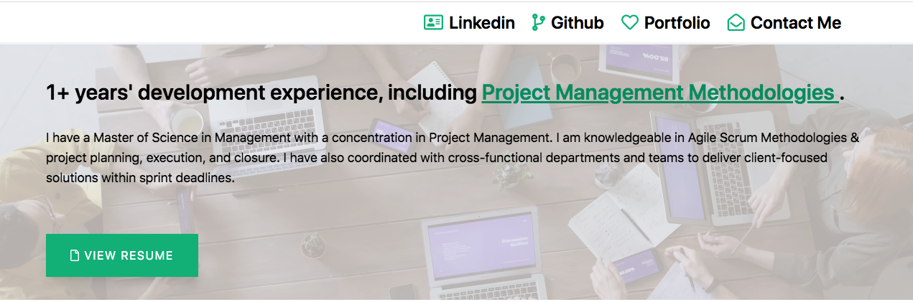
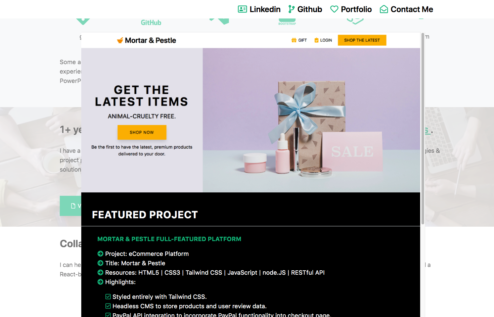
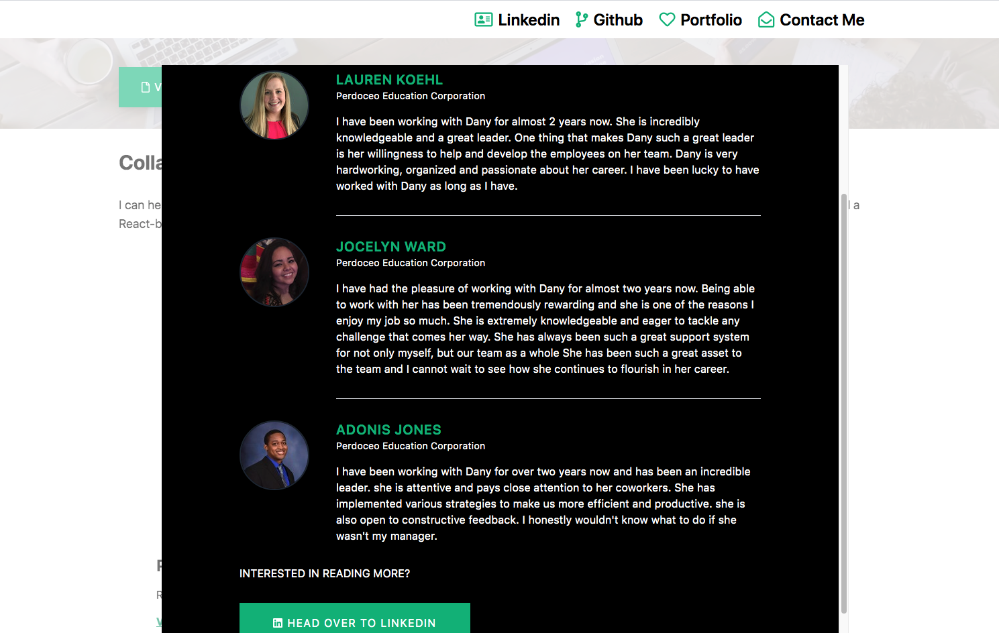

# Dany Chheang - Personal Portfolio   

### Check out the live version of the [Portfolio](https://danychheang.com/)!

# work in progress - currently working on cleaning the code and refactoring

**HTML5 | CSS3 | TAILWIND CSS | JAVASCRIPT | NODE.JS**

A responsive, personal portfolio which is both mobile and desktop ready. The site includes what I do, my stack and skill sets, a featured project with live demo, testimonials, and ways to get in touch with me. Feel free to have a look around and reach out with questions.

---

## Project Highlights

Section | Features | Sample
------------ | ------------- | ------------- 
Header | Responsive header with call to action button that smooth scrolls to the contact form. | 
Toolbox | Features CSS Grids to display content information and icons. | 
PM Experience | Project Management call to action container which links to PM badge and features video background. | 
Project & Testimonials | Features CSS Grids to display content information and icons. | 
Project Modal | Responsive modal which uses JavaScript to open and close modal on click. | 
Testimonial Modal | Responsive modal which uses JavaScript to open and close modal on click. | 
Contact Form | Form input allows users to send me an email.| 

---

## Credits

- Images from [Unsplash](https://unsplash.com/) and [Pexels](https://www.pexels.com/).
- Icons from [Font Awesome](https://fontawesome.com/) and [Devicon](https://devicon.dev/).
- Design, Content, and Code by [Dany Chheang](https://github.com/dcc5235).

---

## Contact

- [Twitter](https://twitter.com/DanyChheang)
- [Website](https://danychheang.com)
- [Linkedin](https://www.linkedin.com/in/danychheang/)
